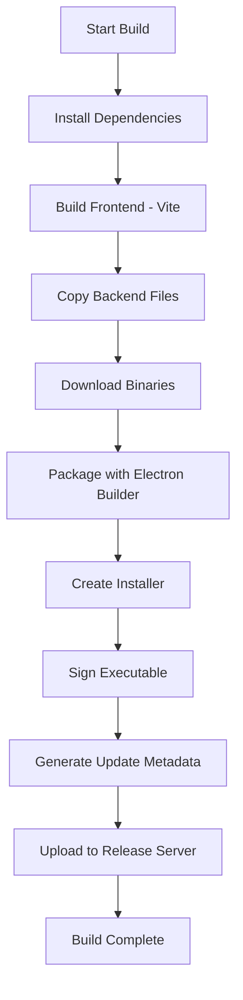
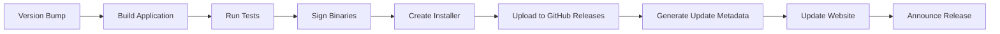

# Design Document

## Overview

This document outlines the technical design for converting the YouTube Downloader Pro web application into a standalone Windows desktop application using Electron. The solution will package the React frontend, Node.js backend, and all dependencies (including yt-dlp and ffmpeg) into a single distributable .exe installer.

### Technology Stack

- **Electron**: v28+ for desktop application framework
- **Electron Builder**: For packaging and creating installers
- **Electron Updater**: For automatic updates
- **Existing Stack**: React 18, TypeScript, Node.js 18+, Express, Socket.IO

### Design Goals

1. Zero-configuration installation for end users
2. Native Windows integration (system tray, notifications, menus)
3. Automatic bundling of all dependencies
4. Seamless frontend-backend communication
5. Minimal resource footprint
6. Professional installer and uninstaller experience

## Architecture

### High-Level Architecture

```
┌─────────────────────────────────────────────────────────┐
│                  Electron Main Process                   │
│  ┌────────────────────────────────────────────────────┐ │
│  │  Application Lifecycle Manager                     │ │
│  │  - Window Management                               │ │
│  │  - System Tray Integration                         │ │
│  │  - Auto-updater                                    │ │
│  └────────────────────────────────────────────────────┘ │
│  ┌────────────────────────────────────────────────────┐ │
│  │  Backend Server Manager                            │ │
│  │  - Start/Stop Express Server                       │ │
│  │  - Port Management                                 │ │
│  │  - Health Monitoring                               │ │
│  └────────────────────────────────────────────────────┘ │
│  ┌────────────────────────────────────────────────────┐ │
│  │  IPC Communication Layer                           │ │
│  │  - Frontend ↔ Main Process                        │ │
│  │  - Settings Management                             │ │
│  │  - File System Operations                          │ │
│  └────────────────────────────────────────────────────┘ │
└─────────────────────────────────────────────────────────┘
                          │
        ┌─────────────────┴─────────────────┐
        │                                   │
┌───────▼────────┐              ┌──────────▼──────────┐
│ Renderer       │              │  Backend Server     │
│ Process        │              │  (Express)          │
│                │              │                     │
│ React Frontend │◄────HTTP─────┤  - REST API        │
│ (Vite Build)   │              │  - Socket.IO       │
│                │◄──WebSocket──┤  - yt-dlp wrapper  │
└────────────────┘              └─────────────────────┘
```


### Process Architecture

**Main Process (Electron)**
- Manages application lifecycle (startup, shutdown, updates)
- Creates and controls BrowserWindow instances
- Handles system tray and native menus
- Starts and monitors the backend Express server
- Manages IPC communication with renderer process
- Handles file system operations with elevated permissions

**Renderer Process (Frontend)**
- Loads the built React application (from Vite build)
- Communicates with backend via HTTP/WebSocket (localhost)
- Uses IPC to communicate with main process for native features
- Displays UI and handles user interactions

**Backend Server (Node.js/Express)**
- Runs as a child process managed by main process
- Listens on dynamic port (finds available port automatically)
- Provides REST API and Socket.IO for downloads
- Executes yt-dlp and ffmpeg from bundled binaries
- Manages download queue and file operations

## Components and Interfaces

### 1. Main Process Components

#### Application Manager (`src/electron/main.ts`)

```typescript
interface ApplicationConfig {
  isDevelopment: boolean;
  appVersion: string;
  userDataPath: string;
  resourcesPath: string;
}

class ApplicationManager {
  private mainWindow: BrowserWindow | null;
  private tray: Tray | null;
  private backendServer: BackendServerManager;
  
  async initialize(): Promise<void>;
  createMainWindow(): void;
  createSystemTray(): void;
  setupApplicationMenu(): void;
  handleDeepLinks(url: string): void;
}
```

**Responsibilities:**
- Initialize Electron app
- Create main window with proper configuration
- Set up system tray with context menu
- Handle application menu
- Manage window state (minimize to tray, restore)
- Handle deep links (yt-downloader://)


#### Backend Server Manager (`src/electron/backend-manager.ts`)

```typescript
interface ServerConfig {
  port: number;
  host: string;
  downloadsPath: string;
}

interface ServerStatus {
  running: boolean;
  port: number;
  pid: number | null;
  uptime: number;
}

class BackendServerManager {
  private serverProcess: ChildProcess | null;
  private serverPort: number;
  
  async start(): Promise<ServerConfig>;
  async stop(): Promise<void>;
  async restart(): Promise<void>;
  getStatus(): ServerStatus;
  findAvailablePort(): Promise<number>;
  healthCheck(): Promise<boolean>;
}
```

**Responsibilities:**
- Start Express server as child process
- Find available port dynamically
- Monitor server health
- Restart server on failure
- Graceful shutdown on app exit
- Pass environment variables (paths, ports)

#### IPC Handler (`src/electron/ipc-handler.ts`)

```typescript
interface IPCChannels {
  'app:get-version': () => string;
  'app:get-paths': () => AppPaths;
  'settings:get': () => UserSettings;
  'settings:set': (settings: Partial<UserSettings>) => void;
  'download:select-folder': () => string | null;
  'file:open-folder': (path: string) => void;
  'file:open-file': (path: string) => void;
  'notification:show': (options: NotificationOptions) => void;
  'backend:get-url': () => string;
}

class IPCHandler {
  registerHandlers(): void;
  handleSettingsGet(): UserSettings;
  handleSettingsSet(settings: Partial<UserSettings>): void;
  handleFolderSelect(): Promise<string | null>;
  handleFileOpen(filePath: string): void;
}
```

**Responsibilities:**
- Register IPC event handlers
- Provide settings management
- Handle native dialogs (folder picker)
- Open files and folders in system explorer
- Show native notifications
- Provide backend URL to frontend


#### Auto Updater (`src/electron/auto-updater.ts`)

```typescript
interface UpdateInfo {
  version: string;
  releaseDate: string;
  releaseNotes: string;
  downloadUrl: string;
}

interface UpdateStatus {
  checking: boolean;
  available: boolean;
  downloading: boolean;
  progress: number;
  error: string | null;
}

class AutoUpdater {
  private updateCheckInterval: NodeJS.Timeout | null;
  
  initialize(): void;
  checkForUpdates(): Promise<UpdateInfo | null>;
  downloadUpdate(): Promise<void>;
  installUpdate(): void;
  setAutoCheck(enabled: boolean): void;
}
```

**Responsibilities:**
- Check for updates on startup and periodically
- Download updates in background
- Notify user of available updates
- Install updates on user confirmation
- Handle update errors gracefully

### 2. Frontend Integration

#### Electron Bridge (`src/electron/preload.ts`)

```typescript
interface ElectronAPI {
  platform: NodeJS.Platform;
  getVersion(): Promise<string>;
  getPaths(): Promise<AppPaths>;
  getBackendUrl(): Promise<string>;
  
  settings: {
    get(): Promise<UserSettings>;
    set(settings: Partial<UserSettings>): Promise<void>;
  };
  
  files: {
    selectFolder(): Promise<string | null>;
    openFolder(path: string): Promise<void>;
    openFile(path: string): Promise<void>;
  };
  
  notifications: {
    show(options: NotificationOptions): Promise<void>;
  };
  
  updates: {
    check(): Promise<UpdateInfo | null>;
    download(): Promise<void>;
    install(): void;
    onProgress(callback: (progress: number) => void): void;
  };
}

// Exposed to window.electron in renderer
declare global {
  interface Window {
    electron: ElectronAPI;
  }
}
```

**Responsibilities:**
- Provide secure bridge between renderer and main process
- Expose only necessary APIs to frontend
- Type-safe communication layer


#### Frontend Adapter (`client/src/electron-adapter.ts`)

```typescript
class ElectronAdapter {
  isElectron(): boolean;
  
  async getBackendUrl(): Promise<string>;
  async selectDownloadFolder(): Promise<string | null>;
  async openDownloadsFolder(): Promise<void>;
  async showNotification(title: string, body: string): Promise<void>;
  
  // Replace browser APIs with Electron equivalents
  async downloadFile(url: string, filename: string): Promise<void>;
  async openExternal(url: string): Promise<void>;
}

// Usage in React components
const adapter = new ElectronAdapter();
if (adapter.isElectron()) {
  const backendUrl = await adapter.getBackendUrl();
  // Use dynamic backend URL instead of hardcoded localhost
}
```

**Responsibilities:**
- Detect if running in Electron environment
- Provide abstraction layer for Electron-specific features
- Allow web version to continue working without Electron APIs
- Handle backend URL dynamically

### 3. Backend Modifications

#### Path Resolution (`backend/electron-paths.js`)

```typescript
interface ElectronPaths {
  downloads: string;
  userData: string;
  temp: string;
  ytdlp: string;
  ffmpeg: string;
}

class PathResolver {
  static isElectron(): boolean;
  static getResourcesPath(): string;
  static getDownloadsPath(): string;
  static getBinaryPath(name: 'yt-dlp' | 'ffmpeg'): string;
  static getUserDataPath(): string;
}
```

**Responsibilities:**
- Detect if running in Electron
- Resolve paths to bundled binaries (yt-dlp, ffmpeg)
- Provide user data directory for settings
- Handle different paths for development vs production


## Data Models

### User Settings

```typescript
interface UserSettings {
  // Download preferences
  downloadPath: string;
  defaultQuality: QualityType;
  defaultType: 'video' | 'audio';
  maxConcurrentDownloads: number;
  
  // Application preferences
  theme: 'light' | 'dark' | 'system';
  minimizeToTray: boolean;
  startOnBoot: boolean;
  closeToTray: boolean;
  
  // Update preferences
  autoCheckUpdates: boolean;
  autoDownloadUpdates: boolean;
  
  // Notification preferences
  showDesktopNotifications: boolean;
  notifyOnComplete: boolean;
  notifyOnError: boolean;
  
  // Advanced
  customYtdlpPath: string | null;
  customFfmpegPath: string | null;
  proxyUrl: string | null;
}
```

### Application Paths

```typescript
interface AppPaths {
  app: string;           // Application installation directory
  userData: string;      // User data directory (settings, logs)
  downloads: string;     // Default downloads directory
  temp: string;          // Temporary files directory
  logs: string;          // Application logs directory
  resources: string;     // Bundled resources (binaries)
}
```

### Window State

```typescript
interface WindowState {
  width: number;
  height: number;
  x: number;
  y: number;
  isMaximized: boolean;
  isFullScreen: boolean;
}
```

## Error Handling

### Error Categories

1. **Server Startup Errors**
   - Port already in use → Find alternative port
   - Backend files missing → Show error dialog with reinstall option
   - Permission denied → Request elevated permissions

2. **Binary Errors**
   - yt-dlp not found → Attempt auto-download or show manual instructions
   - ffmpeg not found → Attempt auto-download or show manual instructions
   - Binary execution failed → Show detailed error with logs

3. **Download Errors**
   - Network errors → Retry with exponential backoff
   - Disk space errors → Show warning and pause downloads
   - Permission errors → Request folder access

4. **Update Errors**
   - Update check failed → Silent fail, retry later
   - Download failed → Show error, allow manual download
   - Installation failed → Rollback and show error


### Error Handling Strategy

```typescript
class ErrorHandler {
  static handleServerError(error: Error): void {
    // Log error
    logger.error('Server error:', error);
    
    // Show user-friendly dialog
    dialog.showErrorBox(
      'Server Error',
      'Failed to start backend server. Please restart the application.'
    );
    
    // Attempt recovery
    if (canRecover(error)) {
      attemptRecovery();
    }
  }
  
  static handleBinaryError(binary: string, error: Error): void {
    logger.error(`${binary} error:`, error);
    
    const response = dialog.showMessageBoxSync({
      type: 'error',
      title: `${binary} Error`,
      message: `${binary} is missing or corrupted.`,
      buttons: ['Download Automatically', 'Manual Instructions', 'Cancel'],
      defaultId: 0
    });
    
    if (response === 0) {
      downloadBinary(binary);
    } else if (response === 1) {
      shell.openExternal(`https://docs.app.com/install-${binary}`);
    }
  }
}
```

### Logging Strategy

```typescript
interface LogEntry {
  timestamp: Date;
  level: 'info' | 'warn' | 'error' | 'debug';
  category: string;
  message: string;
  data?: any;
}

class Logger {
  private logFile: string;
  
  info(category: string, message: string, data?: any): void;
  warn(category: string, message: string, data?: any): void;
  error(category: string, message: string, data?: any): void;
  debug(category: string, message: string, data?: any): void;
  
  getLogPath(): string;
  clearLogs(): void;
  exportLogs(): string;
}
```

**Log Locations:**
- Windows: `%APPDATA%/yt-downloader/logs/`
- Rotation: Keep last 7 days
- Max size: 10MB per file


## Testing Strategy

### Unit Tests

**Main Process Tests**
- Backend server manager (start/stop/restart)
- IPC handler functions
- Path resolution logic
- Settings management
- Error handling

**Frontend Tests**
- Electron adapter functionality
- IPC communication mocking
- Settings UI components

### Integration Tests

**Process Communication**
- Main ↔ Renderer IPC
- Renderer ↔ Backend HTTP/WebSocket
- Main ↔ Backend process management

**File Operations**
- Download path selection
- File system permissions
- Binary execution

### End-to-End Tests

**User Workflows**
- Install application
- First launch experience
- Download a video
- Change settings
- Update application
- Uninstall application

### Manual Testing Checklist

**Installation**
- [ ] Installer runs without admin rights
- [ ] All files copied correctly
- [ ] Shortcuts created
- [ ] Registry entries created
- [ ] First launch successful

**Functionality**
- [ ] Backend starts automatically
- [ ] Frontend loads correctly
- [ ] Downloads work
- [ ] Settings persist
- [ ] System tray works
- [ ] Notifications appear

**Updates**
- [ ] Update check works
- [ ] Update download works
- [ ] Update installation works
- [ ] Settings preserved after update

**Uninstallation**
- [ ] Uninstaller removes all files
- [ ] User data handling (keep/delete)
- [ ] Registry cleaned
- [ ] Shortcuts removed


## Build and Packaging

### Electron Builder Configuration

```json
{
  "appId": "com.ytdownloader.app",
  "productName": "YouTube Downloader Pro",
  "directories": {
    "output": "dist-electron",
    "buildResources": "build-resources"
  },
  "files": [
    "dist/**/*",
    "backend/**/*",
    "!backend/node_modules",
    "!backend/downloads",
    "src/electron/**/*",
    "package.json"
  ],
  "extraResources": [
    {
      "from": "binaries/yt-dlp.exe",
      "to": "binaries/yt-dlp.exe"
    },
    {
      "from": "binaries/ffmpeg.exe",
      "to": "binaries/ffmpeg.exe"
    }
  ],
  "win": {
    "target": ["nsis"],
    "icon": "build-resources/icon.ico",
    "artifactName": "${productName}-Setup-${version}.${ext}",
    "requestedExecutionLevel": "asInvoker"
  },
  "nsis": {
    "oneClick": false,
    "allowToChangeInstallationDirectory": true,
    "createDesktopShortcut": true,
    "createStartMenuShortcut": true,
    "shortcutName": "YouTube Downloader Pro",
    "installerIcon": "build-resources/installer-icon.ico",
    "uninstallerIcon": "build-resources/uninstaller-icon.ico",
    "license": "LICENSE"
  },
  "publish": {
    "provider": "github",
    "owner": "Thamarai149",
    "repo": "yt-downloader"
  }
}
```

### Build Process



### Build Scripts

```json
{
  "scripts": {
    "electron:dev": "concurrently \"npm run dev\" \"electron .\"",
    "electron:build": "npm run build:all && electron-builder",
    "build:all": "npm run build:frontend && npm run build:backend",
    "build:frontend": "cd client && npm run build",
    "build:backend": "cd backend && npm install --production",
    "download:binaries": "node scripts/download-binaries.js",
    "package:win": "electron-builder --win --x64",
    "release": "npm run electron:build && npm run upload:release"
  }
}
```


### Binary Management

**Download Script (`scripts/download-binaries.js`)**

```javascript
const binaries = [
  {
    name: 'yt-dlp',
    url: 'https://github.com/yt-dlp/yt-dlp/releases/latest/download/yt-dlp.exe',
    path: 'binaries/yt-dlp.exe',
    checksum: 'sha256:...'
  },
  {
    name: 'ffmpeg',
    url: 'https://github.com/BtbN/FFmpeg-Builds/releases/download/latest/ffmpeg-master-latest-win64-gpl.zip',
    path: 'binaries/ffmpeg.exe',
    extract: true,
    checksum: 'sha256:...'
  }
];

async function downloadBinaries() {
  for (const binary of binaries) {
    console.log(`Downloading ${binary.name}...`);
    await downloadFile(binary.url, binary.path);
    await verifyChecksum(binary.path, binary.checksum);
  }
}
```

### Directory Structure (Packaged)

```
YouTube Downloader Pro/
├── YouTube Downloader Pro.exe    # Main executable
├── resources/
│   ├── app.asar                  # Packaged application code
│   ├── binaries/
│   │   ├── yt-dlp.exe
│   │   └── ffmpeg.exe
│   └── backend/                  # Backend server files
│       ├── server.js
│       ├── package.json
│       └── node_modules/
├── locales/                      # Electron localization
├── LICENSE
└── version

User Data Directory (%APPDATA%/yt-downloader/):
├── settings.json
├── logs/
│   ├── main.log
│   ├── backend.log
│   └── renderer.log
├── downloads/                    # Default download location
└── cache/
```

## Security Considerations

### Code Signing

- Sign main executable with valid certificate
- Sign installer with same certificate
- Prevents Windows SmartScreen warnings
- Required for auto-updates

### Content Security Policy

```typescript
const csp = [
  "default-src 'self'",
  "script-src 'self'",
  "style-src 'self' 'unsafe-inline'",
  "img-src 'self' data: https://i.ytimg.com",
  "connect-src 'self' http://localhost:* ws://localhost:*",
  "font-src 'self'",
  "media-src 'self'"
].join('; ');

session.defaultSession.webRequest.onHeadersReceived((details, callback) => {
  callback({
    responseHeaders: {
      ...details.responseHeaders,
      'Content-Security-Policy': [csp]
    }
  });
});
```

### IPC Security

```typescript
// Only expose necessary APIs
contextBridge.exposeInMainWorld('electron', {
  // Safe APIs only
  getVersion: () => ipcRenderer.invoke('app:get-version'),
  selectFolder: () => ipcRenderer.invoke('download:select-folder'),
  
  // No direct access to:
  // - File system
  // - Child process
  // - Native modules
});
```

### Update Security

- Verify update signatures before installation
- Use HTTPS for update checks
- Validate update metadata
- Rollback on failed updates


## Performance Optimization

### Application Startup

**Optimization Strategies:**

1. **Lazy Loading**
   - Load backend server after window is visible
   - Defer non-critical initialization
   - Show splash screen during startup

2. **Resource Optimization**
   - Use app.asar for faster file access
   - Minimize main process dependencies
   - Preload critical resources

3. **Window Creation**
   ```typescript
   const mainWindow = new BrowserWindow({
     width: 1200,
     height: 800,
     show: false, // Don't show until ready
     backgroundColor: '#ffffff',
     webPreferences: {
       nodeIntegration: false,
       contextIsolation: true,
       preload: path.join(__dirname, 'preload.js')
     }
   });
   
   // Show when ready
   mainWindow.once('ready-to-show', () => {
     mainWindow.show();
   });
   ```

### Memory Management

**Strategies:**

1. **Renderer Process**
   - Limit cache size
   - Clear unused resources
   - Use virtual scrolling for large lists

2. **Backend Process**
   - Limit concurrent downloads
   - Stream large files
   - Clean up temp files

3. **Main Process**
   - Minimize global state
   - Use weak references where appropriate
   - Monitor memory usage

### Bundle Size Optimization

**Frontend:**
- Code splitting by route
- Tree shaking unused code
- Compress assets
- Use production builds

**Backend:**
- Include only production dependencies
- Remove dev dependencies
- Minimize node_modules size

**Target Sizes:**
- Installer: < 150MB
- Installed: < 300MB
- Runtime memory: < 300MB


## Deployment and Distribution

### Release Process



### Update Server Configuration

**GitHub Releases (Recommended)**

```typescript
// Auto-updater configuration
autoUpdater.setFeedURL({
  provider: 'github',
  owner: 'your-username',
  repo: 'yt-downloader',
  private: false
});

// Update check
autoUpdater.checkForUpdates();
```

**Custom Server (Alternative)**

```json
{
  "version": "1.0.0",
  "releaseDate": "2024-01-15",
  "releaseNotes": "- Feature 1\n- Bug fix 2",
  "platforms": {
    "win32": {
      "url": "https://releases.app.com/YT-Downloader-Setup-1.0.0.exe",
      "sha256": "abc123..."
    }
  }
}
```

### Distribution Channels

1. **Direct Download**
   - Host installer on website
   - Provide download link
   - Include installation instructions

2. **GitHub Releases**
   - Automatic with electron-builder
   - Version tracking
   - Release notes

3. **Microsoft Store** (Future)
   - Requires APPX packaging
   - Additional certification
   - Automatic updates via Store

### Version Management

**Semantic Versioning:**
- MAJOR.MINOR.PATCH (e.g., 1.0.0)
- MAJOR: Breaking changes
- MINOR: New features
- PATCH: Bug fixes

**Version Locations:**
- package.json (source of truth)
- electron-builder.json
- About dialog
- Update metadata


## Migration Strategy

### Existing Users

For users currently running the web version:

1. **Data Migration**
   - Export download history from web version
   - Import into desktop app on first launch
   - Migrate settings and preferences

2. **Transition Guide**
   - Provide clear installation instructions
   - Explain benefits of desktop version
   - Offer side-by-side comparison

### Development Workflow

**Phase 1: Setup**
- Install Electron dependencies
- Create main process structure
- Set up build configuration

**Phase 2: Integration**
- Integrate existing frontend
- Adapt backend for Electron
- Implement IPC communication

**Phase 3: Features**
- Add system tray
- Implement auto-updater
- Bundle binaries

**Phase 4: Polish**
- Add native menus
- Implement keyboard shortcuts
- Optimize performance

**Phase 5: Testing**
- Unit tests
- Integration tests
- User acceptance testing

**Phase 6: Release**
- Code signing
- Create installer
- Publish release

## Technical Decisions

### Why Electron?

**Pros:**
- Reuse existing React/TypeScript codebase
- Cross-platform potential (Windows, macOS, Linux)
- Large ecosystem and community
- Built-in auto-updater
- Native API access

**Cons:**
- Larger bundle size (~150MB)
- Higher memory usage
- Chromium overhead

**Alternatives Considered:**
- Tauri: Smaller size but less mature, Rust learning curve
- NW.js: Similar to Electron but smaller community
- Native (C#/WPF): Complete rewrite required

**Decision:** Electron chosen for code reuse and mature ecosystem.

### Why Not PWA?

**PWA Limitations:**
- No system tray support
- Limited file system access
- No bundled binaries
- Requires separate backend installation
- No auto-updates for desktop

**Desktop App Advantages:**
- Full native integration
- Bundled dependencies
- Better offline support
- Professional appearance
- Single-click installation


## Implementation Priorities

### Must Have (MVP)

1. **Core Functionality**
   - Electron app launches successfully
   - Backend server starts automatically
   - Frontend loads and connects to backend
   - Downloads work end-to-end
   - Settings persist between sessions

2. **Native Integration**
   - System tray with basic menu
   - Native notifications
   - Folder picker dialog
   - Open downloads folder

3. **Packaging**
   - Windows installer (.exe)
   - Bundled yt-dlp and ffmpeg
   - Desktop shortcut creation
   - Uninstaller

### Should Have (v1.1)

1. **Enhanced Features**
   - Auto-updater
   - Application menu
   - Keyboard shortcuts
   - Minimize to tray
   - Start on boot option

2. **Polish**
   - Splash screen
   - Better error messages
   - Crash reporting
   - Logging system

### Nice to Have (v1.2+)

1. **Advanced Features**
   - Deep link support (yt-downloader://)
   - Context menu integration
   - Multiple window support
   - Custom themes

2. **Cross-Platform**
   - macOS support
   - Linux support

## Success Metrics

### Technical Metrics

- **Startup Time:** < 3 seconds
- **Memory Usage:** < 300MB idle
- **Installer Size:** < 150MB
- **Installation Time:** < 30 seconds
- **Crash Rate:** < 0.1%

### User Experience Metrics

- **Installation Success Rate:** > 95%
- **First Download Success:** > 90%
- **User Retention:** > 80% after 7 days
- **Update Adoption:** > 70% within 30 days

### Performance Benchmarks

- **Download Speed:** Match web version
- **UI Responsiveness:** 60fps animations
- **Backend Response Time:** < 100ms
- **Search Results:** < 2 seconds

## Risks and Mitigation

### Technical Risks

| Risk | Impact | Probability | Mitigation |
|------|--------|-------------|------------|
| Binary bundling fails | High | Medium | Test on multiple systems, provide fallback download |
| Port conflicts | Medium | Low | Dynamic port allocation, retry logic |
| Auto-update breaks app | High | Low | Rollback mechanism, staged rollout |
| Memory leaks | Medium | Medium | Regular testing, memory profiling |
| Antivirus false positives | High | Medium | Code signing, whitelist submission |

### User Experience Risks

| Risk | Impact | Probability | Mitigation |
|------|--------|-------------|------------|
| Complex installation | High | Low | One-click installer, clear instructions |
| Settings not intuitive | Medium | Medium | User testing, tooltips |
| Poor performance | High | Low | Performance testing, optimization |
| Update disrupts workflow | Medium | Medium | Background updates, user control |

## Conclusion

This design provides a comprehensive blueprint for converting the YouTube Downloader Pro web application into a professional Windows desktop application. The architecture leverages Electron's strengths while maintaining the existing codebase, ensuring a smooth development process and excellent user experience.

Key benefits of this approach:
- **Code Reuse:** 90%+ of existing code can be reused
- **Native Integration:** Full Windows feature support
- **Professional Polish:** Installer, auto-updates, system tray
- **User-Friendly:** Single-click installation, no configuration
- **Maintainable:** Clear separation of concerns, modular design

The phased implementation approach allows for iterative development and testing, ensuring a stable and polished final product.
